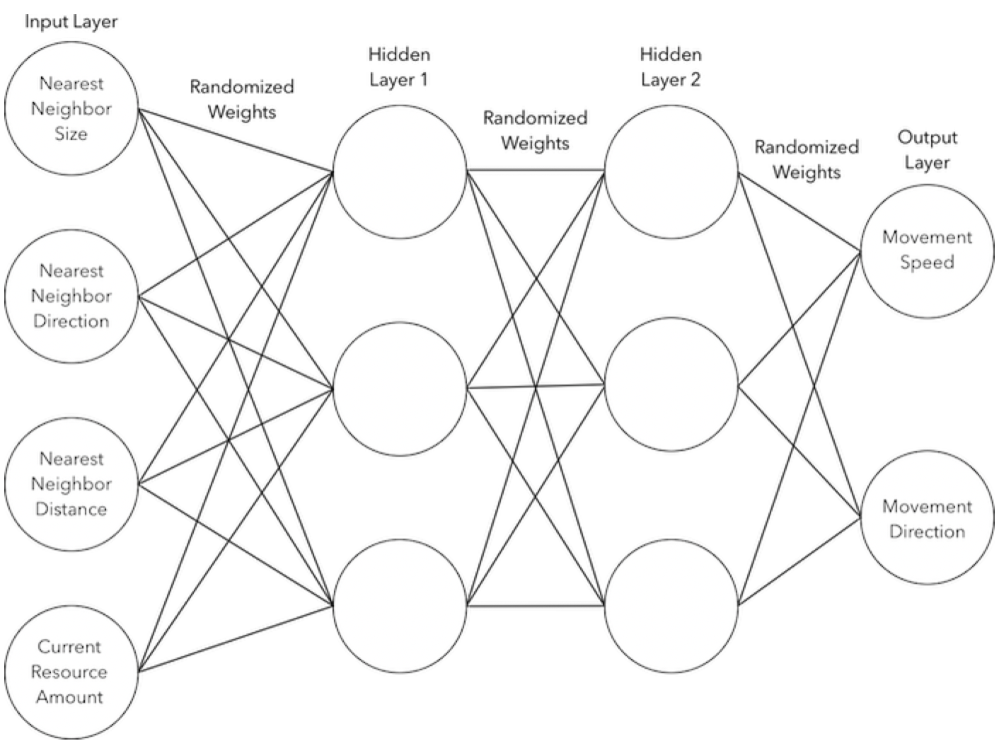
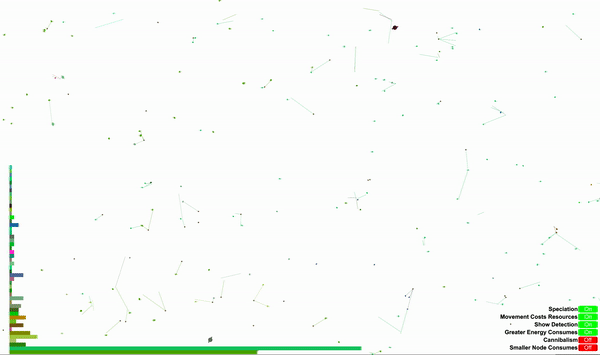
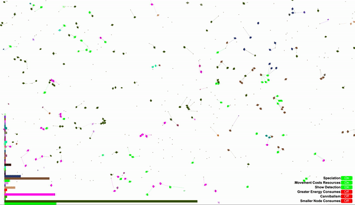
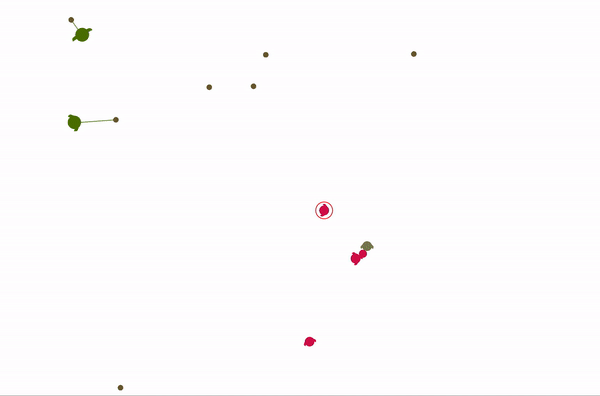
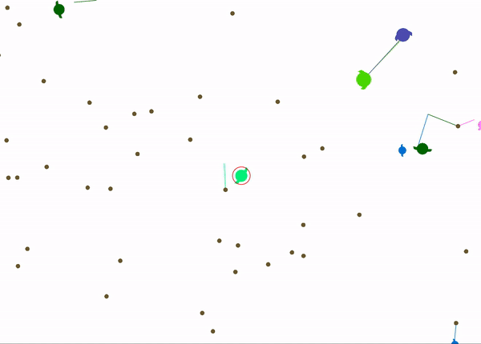
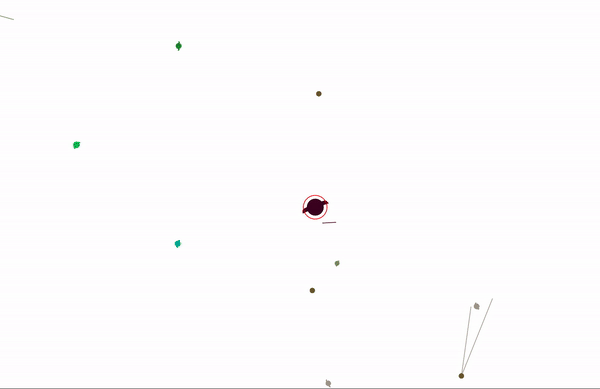
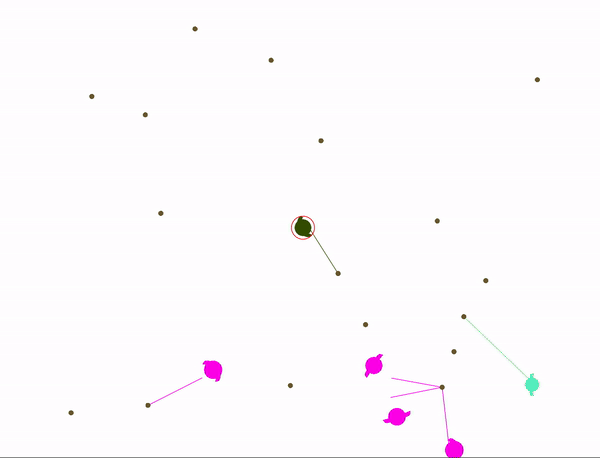
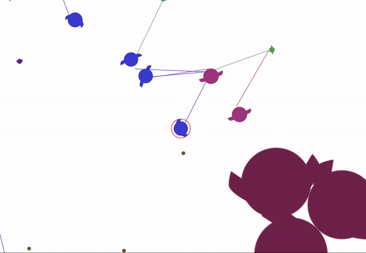
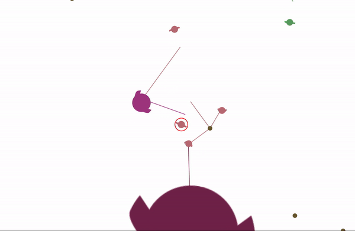

## Simulating Natural Selection in Swift
#### By Max Kleinsasser

A combination of the prerequisites for evolution and some elementary machine learning creating an interesting exemplification of natural selection.

The idea was to create a virtual environment containing very simple entities capable of evolving physically and more importantly behaviorally.

### How

Each node (colored circle with flippers) you see is equipped with a small neural network for determining it's movement. The network takes 4 inputs:

- Nearest neighbor size (relative to it's own)
- Nearest neighbor direction (0-360)
- Nearest neighbor distance
- Current resource supply (as a ratio of it's capacity)

And has 2 output values:

- Next movement speed
- Next movement direction

Using the calculations from it's neural network a force is applied to the node's physics body with the direction and speed calculated 4 times per second.

### Conditions for Natural Selection

#### 1. Reproduction

Nodes can reproduce on a timer when they have filled at least 25% of their resource capacity

#### 2. Heredity

When a node reproduces, it's offspring inherits the traits of it's parent.

#### 3. Variation

A node's color is the physical representation of it's species. The overall node population varies by the random new species of node that are spawned into it. If you see a cluster of nodes that are the same color, it probably means that species of node tends to move toward the resources when it detects them (detection is shown by the colored lines).

Furthermore, nodes vary within their species, every time a node is produced by a parent, it takes a slightly altered version of it's parent's traits (including the weights of it's neural network). All network optimizations are achieved by this method of inheritance.

Further furthermore, if any reproduced node is calculated as different enough from its ancestors, it will be given an altered color and declared a new species. This is referred to as speciation and prevents any one species from inhibiting variation as well as mimics the natural phenomena of the same name. It is also important to note that members of the same species are not allowed to detect or consume each other.

#### 4. Scarcity/Competition

Nodes starve if they don't collect resources (the little brown dots). They can also eat or be eaten by other nodes based on size. Nodes that don't move toward resources starve, nodes that get eaten also die. Only species that possess reproduction-encouraging traits live on (e.g. movement toward food, larger size).

### Below are the results of some of the more interesting simulations

#### Simulation Snapshots

5-minutes timelapse of a simulation right after re-configuring from favoring smaller nodes to larger nodes.

What the majority of default configuration simulations look like: 2 dominant species competing for area.

When the simulation is configured to favor smaller, faster moving node upon collision. Took about 10 minutes to reach this point.

A particularly diverse crew with default configurations after about 5 minutes.

The result of running a 20 hour simulation that favors larger nodes.

The same simulation as before but after some amount of speciation among the larger nodes.

#### Individual Node Tracks
For entertainment purposes.

#### Code
If you're interested in code the neural network implementation is in Node.swift and the nearest neighbor
algorithm that I'm somewhat proud of is in Quad.swift
