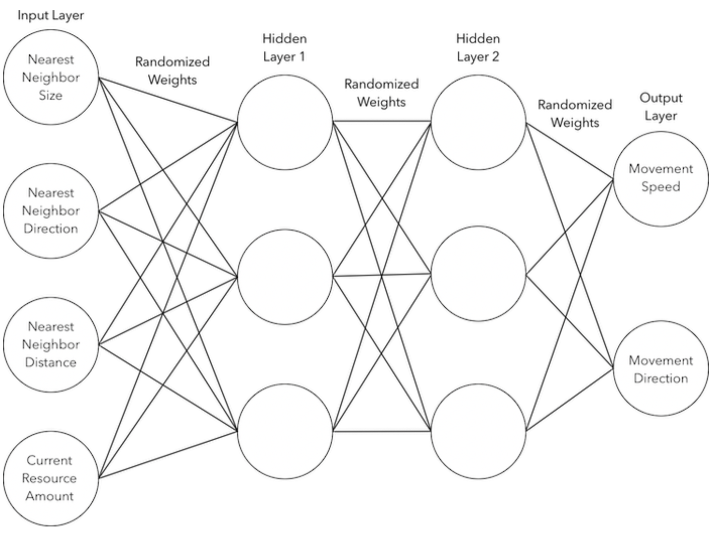

## Simulating Natural Selection in Swift
#### By Max Kleinsasser

A combination of the prerequisites for evolution and some elementary machine learning creating an interesting exemplification of natural selection.

The idea was to create a virtual environment containing very simple entities capable of evolving behaviorally and a little bit physically.

### How

Each node (colored circle with flippers) you see is equipped with a small neural network for determining it's movement. The network takes 4 inputs:

- Nearest neighbor size (relative to it's own)
- Nearest neighbor direction (0-360)
- Nearest neighbor distance
- Current resource supply (as a ratio of it's capacity)

And has 2 output values:

- Next movement speed
- Next movement direction

Using the calculations from it's neural network a force is applied to the node's physics body with the direction and speed calculated 4 times per second.
